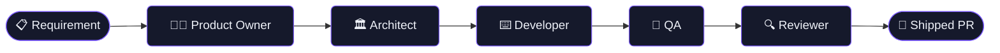

<!-- Banner -->

  

<!-- Typing animation -->

  

<!-- Social badges -->

  
  
  
  
  

---

### 🏭 What I'm building now

> **Autonomous software factories** — teams of AI agents that take a requirement and ship a reviewed pull request end‑to‑end. They run **24×7**, both on a **local cluster** and on **AWS EC2**.

---

### 🚀 About me

- 🤖 **Applied AI Engineer @ Vaisala** — designing multi-agent systems that automate software workflows: code → tests → deploy → maintain
- 🏭 Running **agentic software factories 24×7** on local + **AWS EC2**
- 🧩 Working in **Agentic Workflows, Model Context Protocol (MCP), and Claude Skills**
- 🏗️ **13+ years** of Java 17 / Spring Boot / NestJS on AWS & Kubernetes — renewable energy, smart metering, logistics
- ✍️ I write about practical, tool-centric AI on [Medium @theRealSignet](https://medium.com/@theRealSignet)

---

### 🧰 Tech Stack

  

  
  
  
  

---

### ✍️ Latest writing

- [AI's Next Phase Won't Be Bigger Models — It Will Be Smaller, Specialized, and Tool-Centric](https://medium.com/@theRealSignet)
- [Built a Free AI Code Review Tool for Bitbucket Server Using Just a Markdown File](https://medium.com/@theRealSignet)
- [I Stopped Using AI as a Tool. I Started Architecting With It.](https://medium.com/@theRealSignet)

  

